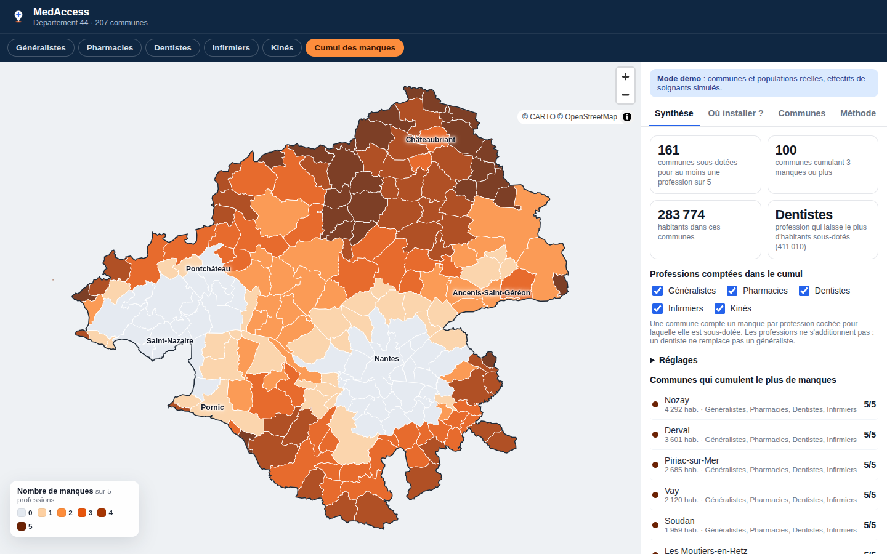
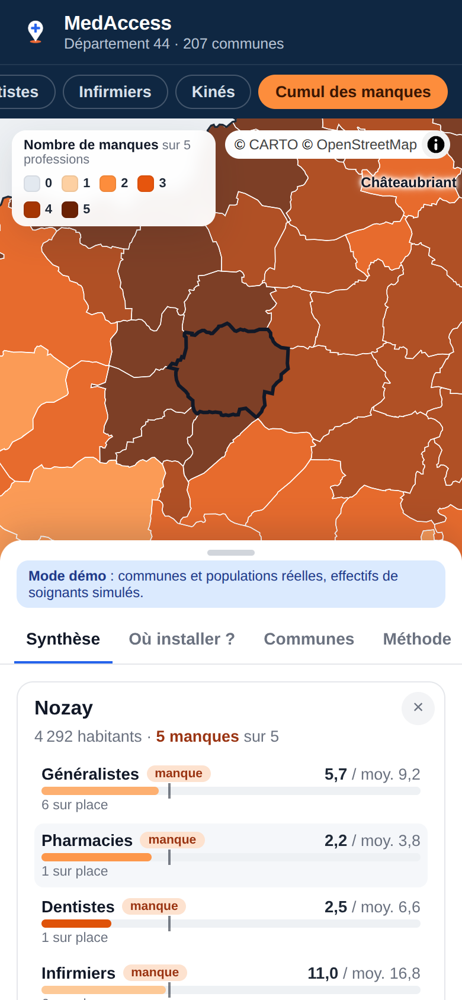

# 🩺 MedAccess — Cartographie de l'accès aux soins de premier recours

Mesure l'accessibilité spatiale à **5 professions de premier recours**
(généralistes, pharmacies, dentistes, infirmiers, kinés) pour chaque commune d'un
département, repère les communes qui **cumulent les manques** et **simule où une
installation aurait le plus d'effet**.

Données publiques, sans clé d'API : **Insee Melodi** (populations, Base permanente
des équipements) et **IGN** (contours des communes, via geo.api.gouv.fr ou la
Géoplateforme). Jointure sur le code commune Insee.



---

## 🎯 La question métier

Élus, ARS, collectivités qui financent une maison de santé se posent la même
question : *où mettre le prochain médecin ?*

La réponse intuitive — « dans la commune la plus mal classée » — n'est pas
toujours la bonne : un hameau isolé sert peu d'habitants, alors qu'un bourg-relais
bien placé peut faire basculer plusieurs communes voisines au-dessus du seuil.
Le simulateur teste chaque commune et compare les deux choix.

---

## 🩺 Cinq professions, et le cumul des manques

| Profession | Distance de recours | Code BPE (nouveau / ancien) |
|---|---|---|
| Généralistes | 30 km | D265 / D201 |
| Pharmacies (officines) | 15 km | D307 / D301 |
| Dentistes | 30 km | D277 / D221 |
| Infirmiers | 20 km | D281 / D232 |
| Kinés | 25 km | D279 / D233 |

- **Une profession à la fois** : la carte, les indicateurs et le simulateur
  changent avec la profession choisie.
- **Cumul des manques** : pour chaque commune, le nombre de professions (cochées)
  pour lesquelles elle est sous-dotée. Pas de score global : les professions ne
  s'additionnent pas (un dentiste ne remplace pas un généraliste) et toute
  pondération serait arbitraire.
- **Fiche commune** : une jauge par profession, avec le seuil marqué.

**Seuil relatif, même règle pour toutes** : une commune est *sous-dotée* quand son
accès est inférieur aux **2/3 de la moyenne du département** (réglable), *fragile*
juste au-dessus. Pour les généralistes de la démo, cela donne ≈ 6 pour 10 000 hab.
Limite : on compare les communes entre elles ; un département globalement
sous-doté n'apparaît pas comme tel.

**Distance de recours** : un professionnel compte pleinement sur place, pour
moitié au tiers de la distance, plus du tout au-delà (généraliste : 50 % à 10 km,
0 au-delà de 30 km). Réglable par profession dans l'appli ou via `RAYONS_KM`.

---

## 📐 Méthode : 2SFCA plutôt que densité

« Médecins pour 10 000 habitants » commune par commune est trompeur : un village
sans médecin à 5 km d'une ville bien dotée n'est pas un désert.

L'indicateur utilise la méthode **2SFCA** (*Two-Step Floating Catchment Area*),
la famille de méthodes de l'**APL officielle de la DREES** :

1. pour chaque commune où exercent des médecins : médecins ÷ population du bassin
   qui y a recours, pondérée par la distance ;
2. pour chaque commune : somme de l'offre accessible, pondérée par la distance.

Poids : 1 sur place, 0,5 à 10 km, 0 au-delà de 30 km (paramétrables).

Sur la démo, **18 communes sans aucun médecin ne sont pas sous-dotées** grâce au
voisinage — exactement ce qu'une densité naïve rate. À l'inverse, certaines
communes paraissent correctement dotées en densité mais sont sous-dotées une fois
la demande du bassin prise en compte.

### Une propriété mathématique qui a changé le simulateur

Le 2SFCA **conserve l'offre** : Σ accès × population = nombre total de médecins
(vérifié par un test). Conséquence : ajouter un médecin, *où que ce soit*,
augmente l'accès moyen de la population d'exactement la même quantité. Ce critère
— le premier qui vient à l'esprit — ne discrimine donc aucune commune.

Le simulateur classe plutôt selon :
1. le nombre d'habitants qui **franchissent le seuil** (lisible pour un élu) ;
2. le gain d'accès des seuls habitants **aujourd'hui sous-dotés**.

---

## 🔌 Sources et points de vigilance

| Donnée | Source | Accès |
|---|---|---|
| Population municipale | Melodi `DS_POPULATIONS_REFERENCE`, filtre `GEO=DEP-44*COM` | API, 30 req/min |
| Soignants par commune (5 professions) | Melodi, fichier BPE (dernier millésime, lu dans le catalogue) | Téléchargement CSV |
| Contours et centres | geo.api.gouv.fr (`geometry=contour`), repli Géoplateforme IGN (WFS Admin Express) | API |

**Millésime du COG.** Melodi renvoie des codes du type `2025-COM-44109` : le
millésime du code officiel géographique est embarqué. Les communes fusionnent
chaque année ; si population, BPE et contours ne sont pas au même millésime,
des communes ne se joignent pas. Le pipeline **produit un rapport de jointure**
(communes sans population, codes BPE non appariés) au lieu de masquer le problème.

**Codes BPE.** La nomenclature de la BPE a été refondue : pour chaque profession,
le premier code présent parmi les candidats (tableau ci-dessus) est retenu et
consigné dans `data/communes_<dep>.json` (clé `codes_bpe`). **À vérifier au premier
lancement réel.** Une profession introuvable est signalée (`professions_absentes`,
avec la liste des codes santé présents) et masquée dans l'appli ; seuls les
généralistes sont indispensables.

**Carte.** Rendu WebGL (pydeck / deck.gl), fond CARTO. Les contours sont allégés
(simplification à ~20 m, coordonnées arrondies) : la carte d'un département pèse
quelques centaines de Ko et s'affiche instantanément. Palette orange → bleu cassée
au seuil, lisible par les daltoniens. Cliquer une commune ouvre sa fiche ; le
sélecteur « densité naïve » montre ce que l'indicateur spatial corrige.

**Mode démo.** Contours IGN et populations Insee **réels** de Loire-Atlantique,
embarqués dans `data/demo/` ; seuls les effectifs de soignants sont simulés
(voir `data/demo/SOURCES.md`).

**Format Melodi vérifié.** Les tests utilisent une réponse réelle de l'API, extraite
des enregistrements du package officiel de l'Insee (InseeFrLab/melodi).

---

## 🚀 Démarrage

```bash
python -m venv .venv && source .venv/bin/activate   # Windows : .venv\Scripts\activate
pip install -r requirements.txt

make data DEP=44   # télécharge et met en cache (≈1 min, quota Melodi respecté)
make app           # carte → http://localhost:8501
make api           # API  → http://localhost:8000/docs

make demo          # hors ligne : vraies communes de Loire-Atlantique, soignants simulés
```

## 🌍 Mettre en ligne

Deux versions, pour deux publics :

| | Appli web installable (PWA) | Tableau de bord Streamlit |
|---|---|---|
| Pour qui | élus, ARS, grand public, sur téléphone | analyste |
| Où | GitHub Pages (gratuit) | Streamlit Community Cloud (gratuit) |
| Serveur | aucun : tout est calculé dans le navigateur | Python |
| Hors ligne | oui, une fois installée | non |

<p align="center"></p>

### Appli web + mobile (GitHub Pages)

1. Pousser le dépôt sur GitHub.
2. *Settings → Pages → Source* : **GitHub Actions**.
3. Le workflow `pages.yml` télécharge les **vraies** données Insee, puis publie
   `https://<compte>.github.io/<dépôt>/`. Il les rafraîchit chaque mois.
   Autre département : *Settings → Variables → Actions*, `DEPARTEMENT=29`.

Installer sur téléphone :
- **Android (Chrome)** : bouton « Installer l'appli » dans l'en-tête, ou menu ⋮ → *Installer*.
- **iPhone (Safari)** : *Partager* → *Sur l'écran d'accueil*.

En local : `make data && make web && make serve` → http://localhost:8080.

Le calcul 2SFCA et le simulateur sont réécrits en JavaScript (`web/calc.js`). Un
test vérifie qu'ils donnent **exactement** les mêmes résultats que Python.

### Tableau de bord (Streamlit Community Cloud)

share.streamlit.io → *New app* → ce dépôt, fichier `app/streamlit_app.py`,
Python 3.11. Les données sont téléchargées au premier affichage (≈ 1 min).

### Et les stores (App Store, Google Play) ?

Pas nécessaire pour démarrer : la PWA s'installe comme une appli. Pour une fiche
sur les stores, emballer `web/` avec Capacitor (compte Apple 99 $/an, Google 25 $).

## 🔌 API

| Endpoint | Description |
|---|---|
| `/departement/{dep}/synthese?profession=dentistes` | Indicateurs clés + rapport de jointure |
| `/departement/{dep}/communes?profession=kines&classe=sous-dotée` | Communes et leur accès |
| `/departement/{dep}/manques` | Nombre de manques par commune (5 professions) |
| `/departement/{dep}/installation?profession=pharmacies&medecins=3` | Meilleurs sites d'installation |

## ✅ Tests (28)

Parsing du format Melodi réel, détection des colonnes BPE, **conservation de
l'offre**, commune isolée sans accès, commune desservie par sa voisine, ajout d'un
médecin jamais pénalisant, meilleur site ≥ commune la plus mal classée, cohérence
du jeu simulé avec les ordres de grandeur nationaux, endpoints API, centres de
communes à l'intérieur des contours, allègement des géométries, repli sur les
contours embarqués quand le réseau est coupé, parité exacte du calcul JavaScript
avec Python (5 professions, seuils, cumul), fichiers de la PWA, choix des codes BPE
nouveaux/anciens, rayon propre à chaque profession, invariance du seuil relatif.

```bash
make test
```

---

## ⚠️ Limites

- Distances **à vol d'oiseau** entre centres de communes, pas en temps de trajet.
- Médecins comptés **par tête**, pas en équivalent temps plein.
- Population **non pondérée par l'âge** (l'APL officielle en tient compte).
- Pas de prise en compte des **départs en retraite** : la vraie urgence est souvent
  là, pas dans la carte d'aujourd'hui.
- Le seuil (2/3 de la moyenne départementale) est une **convention de ce projet**. Le
  zonage réglementaire repose sur l'APL de la DREES.

## 🗺️ Roadmap

- [ ] Temps de trajet routier (OSRM ou Géoplateforme IGN) à la place du vol d'oiseau
- [ ] Pondération par l'âge avec la pyramide Insee par commune
- [ ] Âge des médecins (Annuaire santé / RPPS) → projection des départs à 5 ans
- [ ] Comparaison avec l'APL officielle de la DREES pour valider l'indicateur
- [x] Extension aux autres professions (pharmacies, dentistes, infirmiers, kinés)
- [ ] Maison de santé : placer un groupe de soignants et réduire le plus de manques

## 📜 Licence
MIT — données © Insee, © IGN / Etalab (Licence Ouverte).
